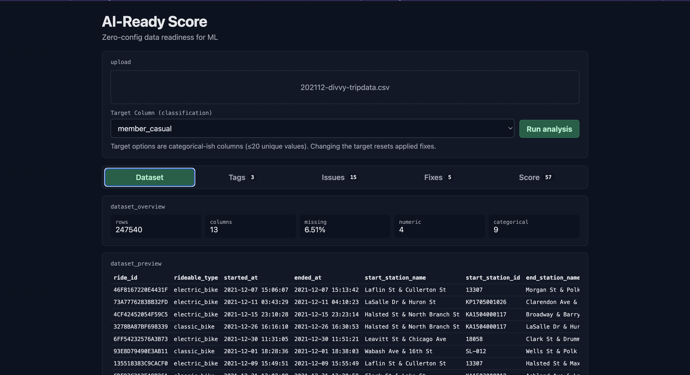
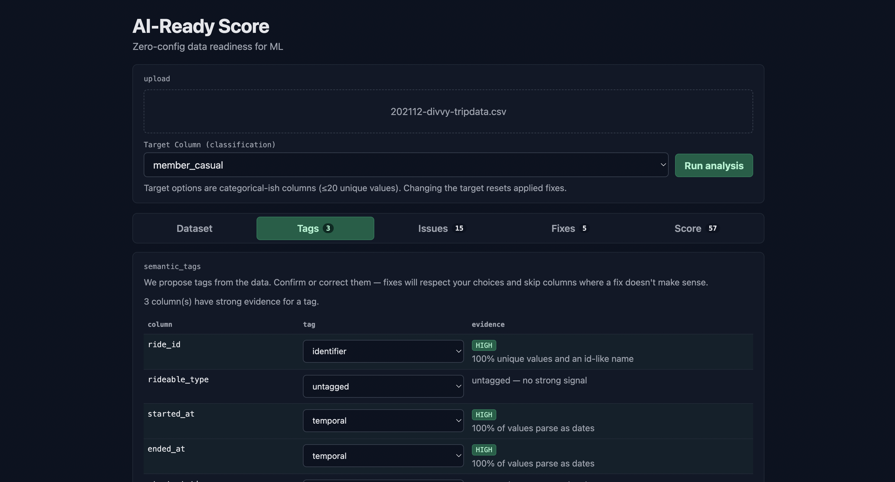
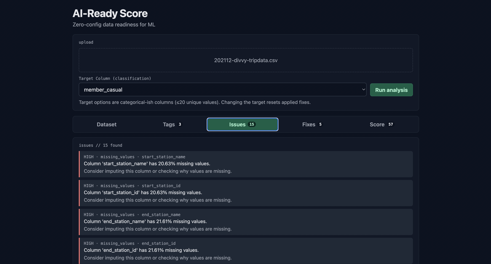

# AI-Ready Score

Upload a tabular CSV, get a **0–100 data readiness score**, inspect quality issues, and apply **one fix at a time** while seeing what each fix *costs* — not just what it gains.

Most cleaning tools only show the score going up. This app is built around a different idea:

> Every fix trades one property for another. The score only counts issue-absence, so it always rewards the trade and never sees the cost. **The warnings are the product.**

## Features

- **Quality checks** — missing values, duplicates, constant / near-constant columns, high cardinality, mixed casing, numeric outliers, high correlation, class imbalance
- **AI-Ready score** — 0–100 with grade, severity counts, and plain-language summary
- **Fix previews** — each applicable fix is scored in isolation with:
  - score before → after
  - what it resolves
  - what new issues it may create
  - distribution-shift / row-loss warnings
  - verdict: `safe` | `review` | `destructive`
- **One-fix loop** — no “fix everything”; apply → re-score → re-preview
- **History + reset** — compare against the original upload; download the current CSV anytime
- **Tabbed UI** — Dataset · Issues · Fixes · Score

## Stack

| Layer | Tech |
| --- | --- |
| Backend | FastAPI, pandas, numpy, SDV (Gaussian Copula for class imbalance) |
| Frontend | React + Vite |
| Store | In-memory dataset session (per process; not multi-worker / not durable) |

## Project layout

```
backend/
  main.py          # API routes
  quality.py       # checks + scoring
  fixes.py         # one repair function per check
  fix_preview.py   # cost measurement + preview_fixes()
  store.py         # in-memory dataset sessions
  jsonutil.py      # numpy / NaN-safe JSON
frontend/
  src/             # React UI
```

## Quick start

### 1. Backend

```bash
python3 -m venv .venv
source .venv/bin/activate   # Windows: .venv\Scripts\activate
pip install -r requirements.txt

uvicorn backend.main:app --reload --port 8000
```

API docs: [http://127.0.0.1:8000/docs](http://127.0.0.1:8000/docs)

### 2. Frontend

```bash
cd frontend
npm install
npm run dev
```

App: [http://localhost:5173](http://localhost:5173)

Vite proxies `/api` to the backend (90–120s timeout for SDV-heavy previews).

## Typical workflow

1. Upload a CSV
2. Optionally pick a **target** column (≤20 unique values — categorical candidates)
3. **Run analysis**
4. Open **Issues**, then **Fixes**
5. Read the cost / warnings on a card → **Apply this fix** (or skip it)
6. Check **Score** for before/after and history
7. **Download fixed CSV** or **Reset to original**

Class-imbalance previews train an SDV synthesizer and can take **10–60 seconds** on large files.

## API (high level)

| Method | Path | Purpose |
| --- | --- | --- |
| `POST` | `/api/datasets` | Upload CSV → `dataset_id` |
| `PUT` | `/api/datasets/{id}/target` | Set / clear target (resets applied fixes) |
| `GET` | `/api/datasets/{id}/score` | Score current dataframe |
| `GET` | `/api/datasets/{id}/preview` | Cost-aware fix previews |
| `POST` | `/api/datasets/{id}/apply` | Apply **one** fix by name |
| `POST` | `/api/datasets/{id}/reset` | Restore original upload |
| `GET` | `/api/datasets/{id}/download` | Download current CSV |

Sessions live in memory and expire after about **1 hour** of inactivity. Restarting the server clears them.

## Honesty notes

The score measures **absence of detected issues**, not ground truth.

- Imputed values are estimates, not facts
- Outlier capping can look “clean” while distorting real geography or domain ranges
- Synthetic rows are generated, not observed
- Always read the fix-card warnings before training on the result

 ## How it Works



Screenshot 1 — Upload a CSV and instantly see dataset overview: rows, columns, missing data percentage, and column types.




Screenshot 2 — Semantic tags auto-detect column roles (identifier, temporal, geographic) so fixes don't damage meaningful columns.




Screenshot 3 — 15 quality issues detected, sorted by severity, each with a plain-language explanation.


Screenshot 4 — Fix previews show the cost of each repair before you apply it — score gain, distribution shift, and a safe/review/destructive verdict.


Screenshot 5 — Overall readiness score with severity breakdown and a summary recommendation.

